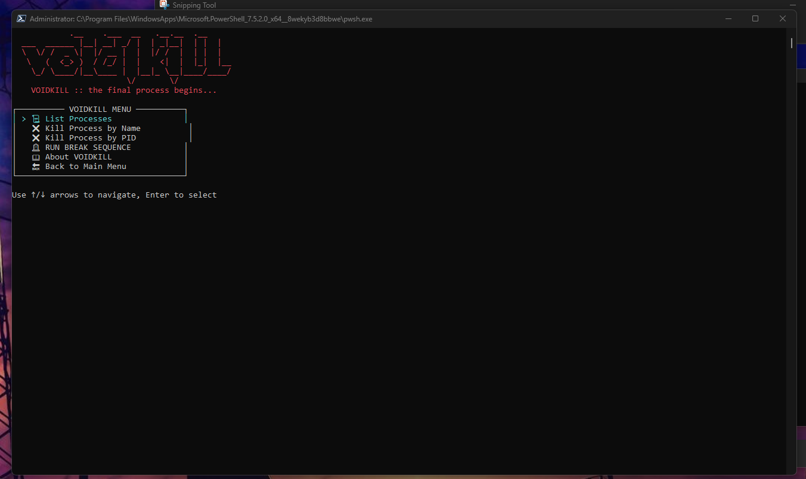

---

# VOIDKILL

**VOIDKILL** is an advanced terminal-based system toolkit for Windows that combines a task manager and a network utility suite. Designed for educational and testing purposes, it provides an interactive way to manage processes and analyze network connectivity.

> ⚠️ **WARNING:** VOIDKILL contains powerful commands that can terminate system-critical processes. Use responsibly and at your own risk. Intended for educational purposes only.

---

## Features

### 🔥 Task Manager

* **Interactive process list** with arrow key navigation.
* **Kill processes** by name or PID.
* **System Break Sequence**: terminate critical system processes (DANGEROUS).
* View **CPU and memory usage** of top processes.
* Quick access to task manager info.

### 🌐 Network Toolkit

* **Domain → IP resolution**.
* **Active network connections** viewer.
* **LAN device scanner** to discover connected devices.
* **IP geolocation lookup** (Country, Region, City, ISP, Coordinates).
* **Ping utility** for measuring connectivity and response times.

### ℹ️ About VOIDKILL

* Author: **@Saaransh\_Xd**
* YouTube: [https://www.youtube.com/@Saaransh\_Xd](https://www.youtube.com/@Saaransh_Xd)
* GitHub: [https://github.com/Saaransh\_Dx](https://github.com/Saaransh_Dx)

---

## Installation

1. **Download the script**:

   ```powershell
    Invoke-WebRequest -Uri "https://raw.githubusercontent.com/SaaranshDx/voidkill/refs/heads/main/voidkill.ps1" -OutFile "VOIDKILL.ps1"
   ```
2. **Run PowerShell as Administrator**.
3. **Execute the script**:

   ```powershell
   .\VOIDKILL.ps1
   ```

---

## Usage

* **Navigation**

  * Use **↑ / ↓ arrow keys** to move between menu items.
  * Press **Enter** to select an option.
  * Press **Escape** to return to the previous menu or exit.

* **Task Manager**

  * List top CPU-consuming processes.
  * Kill processes by **name** or **PID**.
  * Initiate **BREAK SEQUENCE** (destructive).

* **Network Toolkit**

  * Resolve domains to IPs.
  * Scan your LAN for active devices.
  * Lookup IP information including location and ISP.
  * Ping hosts and view detailed statistics.

---

## ⚠️ Break Sequence Warning

The **Break Sequence** function terminates critical Windows processes:

* `winlogon`, `csrss`, `wininit`, `lsass`, `services`, `smss`, `dwm`, `explorer`

> This will likely **crash or brick your system**. Only use if you understand the consequences.

---

## Dependencies

* Windows PowerShell
* Internet connection for network tools (IP lookup)
* Administrative privileges recommended for process management

---

## Screenshots

menu

taskmanager

network tool kit

---

## Contributing

1. Fork the repository.
2. Make your changes.
3. Submit a pull request.

---

## License

This project is **for educational purposes only**. Use responsibly and at your own risk.

---

